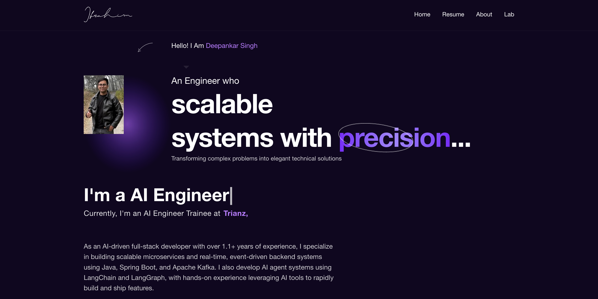

# Deepankar Singh | AI Engineer


Personal portfolio for **Deepankar Singh**, an AI-driven full-stack developer based in Hyderabad, India.



I build scalable microservices, real-time event-driven systems, and AI agent applications using Java, Spring Boot, Apache Kafka, Python, LangChain, and LangGraph. I also develop responsive frontend experiences with TypeScript and React.

## Experience

### AI Engineer, Trianz

**August 2025 - Present**

- Built a real-time data streaming pipeline with Apache Kafka and Spring Boot, reducing downstream data transfer latency by 35%.
- Replaced Trino with Debezium for change data capture and optimized Kafka producers and consumers, improving relational database ingestion and migration speed by 70%.
- Developed high-performance FastAPI services with response caching, reducing API latency by 40%.
- Built responsive TypeScript and React interfaces integrated with backend APIs.
- Expanded Java unit test coverage with JUnit and SonarQube.
- Led client demos and delivered high-priority features under tight deadlines.

## Education

**Master of Computer Applications (MCA)**
National Institute of Technology, Bhopal (NIT Bhopal)
August 2022 - June 2025

## Skills

**Languages:** Java, Python, JavaScript, TypeScript, C, C++
**Backend:** Spring Boot, Microservices, Hibernate, FastAPI, Spring Security
**AI:** LangChain, LangGraph, LLMs, RAG, MCP Server, LangSmith
**Data and messaging:** Apache Kafka, Debezium, MongoDB, Redis, MySQL, PostgreSQL
**Frontend:** React, React.js
**Cloud and engineering:** Docker, Kubernetes, JUnit, SonarQube, Data Structures, Algorithms, LLD, HLD

## Projects

### SHOPY | Full-Stack E-commerce Platform

- Developed a scalable MERN-stack e-commerce application with product discovery, cart management, and order workflows.
- Integrated JWT authentication, Redux Toolkit for global state management, and secure PayPal payment processing.

### SocialSphere | Social Networking Application

- Engineered a responsive social networking application with real-time content posting, interactive feeds, and profile management.
- Built REST APIs with Spring Boot and MySQL, secured with JWT authentication, and paired them with a React and Tailwind CSS frontend.

## Training

- React Basics, Meta
- Advanced Java
- Complete Agentic AI Bootcamp with LangGraph and LangChain

## Achievements

- Solved 300+ coding problems on LeetCode and GeeksforGeeks.
- Earned a 5-star HackerRank rating for problem-solving challenges.
- Cleared the second round of the CodeRush Hackathon hosted by Indus Valley Partners.

## Portfolio Development

This portfolio is built with [Next.js](https://nextjs.org/), [TypeScript](https://www.typescriptlang.org/), and [Tailwind CSS](https://tailwindcss.com). It includes responsive sections for my profile, experience, projects, and resume.

## Run Locally

```bash
npm install
npm run dev
```

Open [http://localhost:3000](http://localhost:3000) in your browser. Edit `app/page.tsx` or the components in `app/components/` to update the portfolio.

## Production Build

```bash
npm run build
npm start
```

## Render Deployment

Deploy this repository as a **Web Service** on Render using:

- **Build command:** `npm ci && npm run build`
- **Start command:** `npm start`
- **Branch:** `main`
